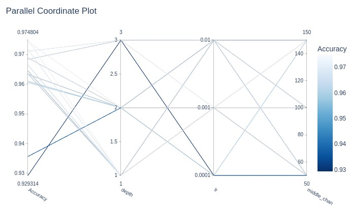
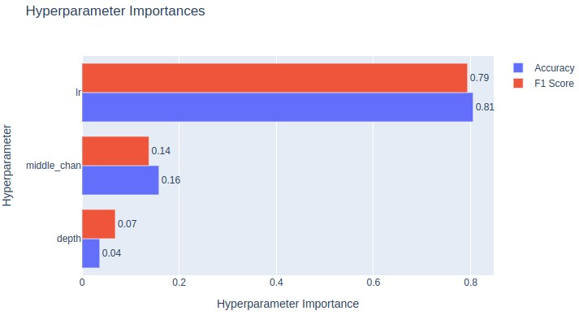

## Hyperparameter Optimization Using Optuna for MNIST Classification

This Jupyter notebook demonstrates hyperparameter optimization using Optuna to find optimal model architecture and training parameters for a multi-layer perceptron (MLP) on the MNIST digit classification task.

Key hyperparameters being optimized:
- Learning rate
- Hidden layer sizes 
- Network depth

The optimization process maximizes both classification accuracy and F1 score. Visualization of parameter importance and optimization history helps understand which hyperparameters have the strongest impact on model performance.


## Requirements
- Python 3.10+
- Jupyter Notebook/Lab
- Required Python packages:
  - pandas
  - numpy
  - matplotlib
  - seaborn
  - torch

## Usage
1. Create a virtul env:

```bash
python -m venv my_env
source .my_env/bin/activate
```

2. Install the required dependencies:

```bash
pip install -r requirement.txt
```

3. Run the jupiter notebook (main.ipynb) in colab or locally in VSCode. 


### Sample plots at the end of the jupyer notebook run

Parallel plot

<a name="top"></a>

<div align="left">


Importance plot

<a name="top"></a>

<div align="left">